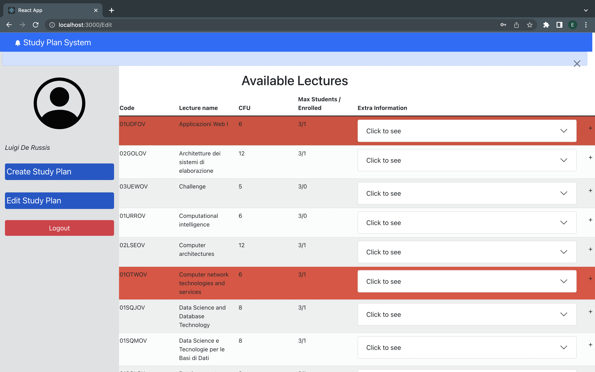
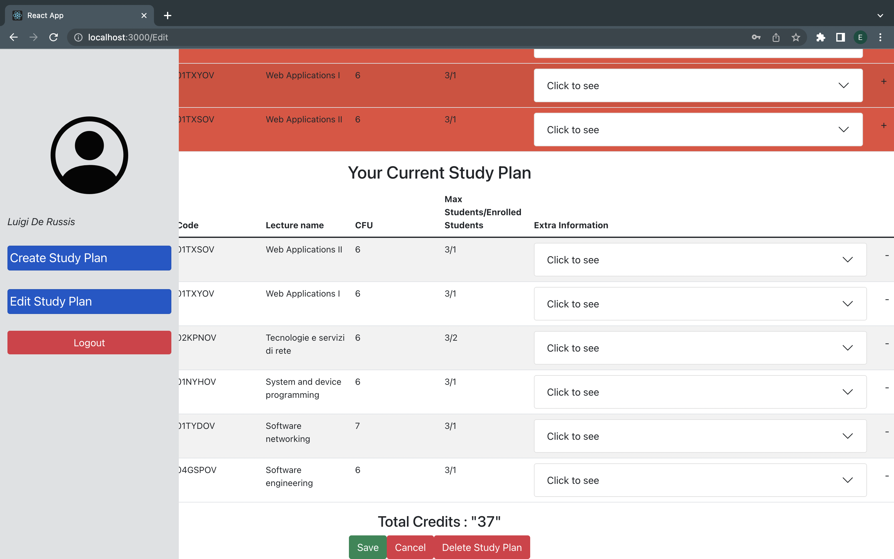

# Exam #12345: "Student Study Plan"
## Student: s302845 YARALI ENES SEMIH 

## React Client Application Routes

- Route `/login`: Takes in username and password for authentication and login.Contains table of all available lectures 
- Route `/`: Main page of the application.Contains All available lectures the lectures that the user is already enrolled in and buttons to edit and create route and a logout button
- Route `/Create`:Contains list of all available lectures, a Form.Select to select the full-time or part-time option of the plan to be created.Save and cancel buttons.
- Route `/Edit`:Contains all available lectures but the lectures that the student cant enroll due to different reasons are marked red.Contains current study plan to be edited.Save and cancel buttons.Delete study plan button to delete the study plan
- Route `*`:Default route.Writes "NO DATA HERE" in the case of misnavigation within routes.

## API Server

- POST `/api/sessions`
  - Request parameters is the credentials object which is retrieved from the login form in the Authcomp.js file.
  - Response body content is the user object which contains the following information of the user : id , username , email, name,partfull (if the student is enrolled fulltime or parttime) 
- GET `/api/sessions/current`
  - request parameters : none 
  - response body content user object which contains the data about the user
- DELETE `/api/logout`
  - request parameters :none request body content : none
  - response body content : none 
  - Logs out the user 

- GET `/api/AllLectures`
  - request parameters and request body content : none
  - response body content : Array of Lecture objects which contain the attributes and data about all the lectures
- GET `/api/currentstudyplan/${student_id}`
  - request parameters : student_id which enables dao to grab the courses that the logged in student is enrolled 
  - response body content : Array of Lecture objects which contains the attributes and data about the lectures that the student is enrolled in
- GET `/api/temp/${student_id}`
  - request parameters : student_id which enables dao to get the temporary study plan to be edited.
  - response body content : Array of Lecture objects which contains the attributes and data about the lectures that the student is enrolled in.
  - POST `/api/edit/addtemp/${student_id}/${course_id}`
  - request parameters: student_id and course_id to be added into the temporary_list table in the database which contains the courses that the student is enrolled in.
  - response body content: succes or fail from the server (200 or 500)
- POST `/api/edit/copytable/${student_id}`
  - request parameters : student_id to copy and create a temporary_list specific to be shown and edited in the edit route.
  - response body content : succes or fail from the server (200 or 500)
- POST `/api/edit/mergetemp`
  - request parameters and request body content : none 
  - response body content : none
- DELETE `/api/edit/cleartemp/`
  - request parameters and request body content : none 
  - response body content : succes or fail from the server (200 or 500)
- DELETE `/api/edit/clearprevious/${student_id}`
  - request parameters : student_id to delete the previous information about the lectures that the student is enrolled in
  - response body content : succes or fail from the server (200 or 500)
- DELETE `/api/edit/deletetemp/${student_id}/${course_id}`
  - request parameters :student_id and course_id to be deleted from the temporary_list table in database
  - response body content : succes or fail from the server (200 or 500)
- POST `/api/login`
  - request parameters and request body content
  - response body content
- PUT `/api/create/settime/${time}/${student_id}`
  - request parameters : time and student_id to set the parttime and fulltime setting of the student
  - response body content : succes or fail from the server (200 or 500)
- POST `/api/edit/incrementenrolled/${course_id}`
  - request parameters : course_id to increment the enrolled student number of the course 
  - response body content : succes or fail from the server (200 or 500)
- DELETE `/api/edit/decrementenrolled/${course_id}`
  -request parameters :  course_id to decrement the enrolled student number of the course 
  -response body content : succes or fail from the server (200 or 500)
- DELETE `/api/edit/deletestudyplan/${student_id}}`
  -request parameters :  student_id to delete the study plan of the logged in student 
  -response body content : succes or fail from the server (200 or 500)

## Database Tables

- Table `Lectures` - contains course_id, code, name, credit, max_student, incompatible_with, prepatory_course, enrolled_student.Attributes of a lecture.Contains all of the lectures available
- Table `enrollment` - contains student_id, course_id .Defines which student is enrolled in which lecture 
- Table `temporary_list` - contains student_id, course_id.Gets copied from the enrollment depending on the user.Edited in the edit route and inserted into the enrollment when save button is clicked.
- Table `user`- contains id, email, password, salt, name, partfull.All the data about the user to be retrieved only partfull column is edited when student creates a study plan.
## Main React Components

- `Lecturetable` (in `lecturetable.js`): Show all of the lectures available with prepatory course and incompatible with compressed with Accordion object from react bootstrap.
- `Addlecturetable` (in `lecturetable.js`):Show all of the lectures available for adding into the the current study plan.Lectures that are unavailable to add are marked red.
- `Alert` (in `lecturetable.js`):Alerts the user about the issues regarding the lecture the student wants to enroll.Alerts constraints regarding the clicked lecture.
- `Deletelectruetable` (in `lecturetable.js`): Show all of the enrolled lectures for deleting from the current study plan(Current study plan is temporary_list in edit route).
- `Addbutton` (in `lecturetable.js`):Add the lecture clicked into the temporary_list do the constraint check if the lecture is available to add into the temporary_list.Increment the enrolled attribute of the course that the student is enrolled.
- `Deletebutton` (in `lecturetable.js`): Delete lecture when clicked from the temporary_list.Decrement the enrollment attribute of the lecture clicked.
- `Sidenavbar` (in `components.js`):Show the name of the student logged in.Contains 3 buttons.Create Route button which links to create route ,Edit Route button which links to edit route, Logout button which logs the student out.
- `Save Buttons` (in `PageRoutes.js`): In edit route this button saves the changes made to the study plan.In create route this button sets the part-time full-time option of the user in database.
- `Cancel buttons` (in `PageRoutes.js`):In edit route this  button deletes the changes made in temporary_list and navigates back to the main page.In create route it just navigates back to the main  page.
- `Delete Study Plan Button` (in `PageRoutes.js`):Deletes the current study plan of the enrolled user permanently.
- `Form.Select` (in `PageRoutes.js`):Select the part time or full time option for the study plan to be created.
- `LoginForm` (in `Authcomp.js`): Takes in username and password for login.
- `LogoutButton` (in `components.js`):Logsout the user.

(only _main_ components, minor ones may be skipped)

## Screenshot

## Users Credentials

- leo@studenti.polito.it , password
- luigi@studenti.polito.it , luigiiii
- enes@studenti.polito.it , enesssss 
- marco@studenti.polito.it , marcoooo
- luca@studenti.polito.it , lucaaaaa
- romeo@studenti.polito.it , romeoooo

## Developer Notes 
-  Due to extensive use of APIs and backend applications this web application can sometimes have server latencies in Edit route this shows the list empty which results in error.When this occurs please refresh the application in the browser and use it slowly.